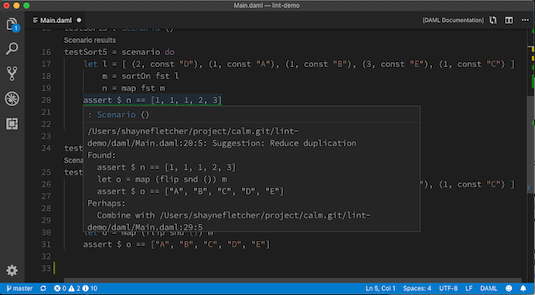

# DLint : Source code suggestions for DAML

We recently added an exciting new feature to the DAML IDE (you can download the IDE [here](https://daml.com/)).

The DLint ("DAML lint") feature provides suggestions for improving your DAML source code as you type! You can get an idea of what this looks like from the image below.

DLint is achieved by the adaption and integration of [Neil Mitchell's](https://ndmitchell.com/) celebrated [HLint](http://hackage.haskell.org/package/hlint) package. HLint is a venerable program with over 15+ years of active development and HLint's use by the Haskell community is ubiquitous. The integration is made possible by the fact that we wrote the DAML IDE in Haskell and that DAML language lexical analysis uses the GHC stack "under the hood".

There is a delightfully symbiotic relationship between DLint and HLint. In order for us to be able to use HLint with DAML, it was necessary (actually this work is ongoing) to replace HLint's dependence on the [`haskell-src-exts`](http://hackage.haskell.org/package/haskell-src-exts) package with the [Digital Asset](https://digitalasset.com/) developed [`ghc-lib-parser`](http://hackage.haskell.org/package/ghc-lib-parser) package. Coincidentally, as [recently announced](https://mail.haskell.org/pipermail/haskell-cafe/2019-May/131166.html), there are to be no more releases of `haskell-src-exts` so Hlint and thereby the Haskell community, get the benefit of this conversion too!

We fully expect to apply what we learned from DLint to the [`hie-core`](https://github.com/digital-asset/daml/tree/master/compiler/hie-core) project (we intend to move this to its own repository soon) and so this same feature for Haskell programs in an open source Haskell IDE is now well within reach. You can read more about our aspirations for Haskell IDEs based on the combination of `hie-core` and the [`haskell-ide-engine`](https://github.com/haskell/haskell-ide-engine) project on our Neil's blog [here](

DLint is achieved by the adaption and integration of [Neil Mitchell's](https://ndmitchell.com/) celebrated [HLint](http://hackage.haskell.org/package/hlint) package. HLint is a venerable program with over 15+ years of active development and HLint's use by the Haskell community is ubiquitous. The integration is made possible by the fact that we wrote the DAML IDE in Haskell and that DAML lexical analysis uses the GHC stack "under the hood".

There is a delightfully symbiotic relationship between DLint and HLint. In order for us to be able to use HLint with DAML, it was necessary (actually this work is ongoing) to replace HLint's dependence on the [`haskell-src-exts`](http://hackage.haskell.org/package/haskell-src-exts) package with the [Digital Asset](https://digitalasset.com/) developed [`ghc-lib-parser`](http://hackage.haskell.org/package/ghc-lib-parser) package. Coincidentally, as [recently announced](https://mail.haskell.org/pipermail/haskell-cafe/2019-May/131166.html), there are to be no more releases of `haskell-src-exts` so Hlint and thereby the Haskell community, get the benefit of this conversion too!

We fully expect to apply what we learned from DLint to the [`hie-core`](https://github.com/digital-asset/daml/tree/master/compiler/hie-core) project (we intend to move this to its own repository soon) and so this same feature for Haskell programs in an open source Haskell IDE is now well within reach. You can read more about our aspirations for Haskell IDEs based on the combination of `hie-core` and the [`haskell-ide-engine`](https://github.com/haskell/haskell-ide-engine) project in this [blog post](https://blog.daml.com/engineering-notes/thoughts-for-a-haskell-ide).
